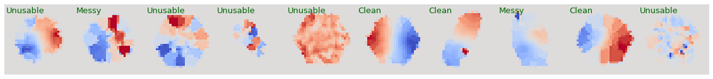

# kin_mis_classifications

Galaxy position angle (PA) measurements and velocity field classifications ([MaNGA](https://www.sdss.org/surveys/manga/)).

This directory finds the PA (i.e. projected rotational direction) of stellar and ionized gas velocity fields for galaxies in MaNGA. Every velocity field for each galaxy (up-to the 8th MaNGA product launch; MPL-8) is given an expert classification (by eye) to determine its reliability/usability. This classification set is used to train a convolutional neural network (CNN), for quick classifications of velocity fields in future data releases (and potentially future surveys).

## Data

Data is taken from the Data Analysis Pipeline ([DAP](https://www.sdss.org/dr15/manga/manga-analysis-pipeline/)) which provides stellar and (ionized) gas velocity fields. Velocity fields are found by fitting the stellar continuum and Hα spectral lines respectively. 

### Position Angle fitting
Each velocity field is further processed so that spuriously high velocity spaxels, and, disconnected regions (not associated with the target galaxy) are removed. Global position angles are fit to each processed velocity field is done using the [fit_kinematic_pa](http://ascl.net/1601.016) routine. These position angles are then re-adjusted to range from 0-360° and the _kinematic misalignment_ (i.e. ΔPA = |PAstel - PAgas|) computed. 

### Expert Classifications
Not all galaxies have well defined rotation (and hence PAs), so the quality/reliability of each velocity field is assigned a classification as such:
  - 0 : Do not use
  - 1 : Messy (potentially usable but maps are typically messy and global PAs will have higher errors)
  - 2 : Clean (global PAs are well behaved and well defined)

Full details on the position angle fitting and classifications are detailed in this [paper](https://ui.adsabs.harvard.edu/abs/2020MNRAS.492.1869D/).

## Neural Network Classifications
With a large set of velocity fields and classifications, this is used to train a convolutional neural network (CNN). This can be used to quickly classify future galaxies in MaNGA. This may also be useful for classifying velocity fields in other surveys **but** further testing will need to be done (for example; MaNGA velocity fields tend to be hexagonal and classification biases may arise).

### Pre-processing for CNN
Here, velocity fields are also taken from the DAP, however, they are now standardised to be (32, 32) in shape, and, the pixel values range [-1, 1]. No other pre-processing is applied here. Examples of the CNN input (with human classifications) can be seen above. 

Both stellar and gas velocity fields are used together to create the following samples:

| Sample  | Count |
| ------------- | ------------- |
| Training | 6343 |
| Test | 2115 |
| Validation | 2115 |

### Architecture
