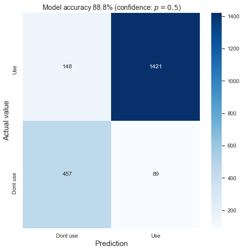

# kin_mis_classifications

Galaxy position angle (PA) measurements and velocity field classifications ([MaNGA](https://www.sdss.org/surveys/manga/)).

This directory finds the PA (i.e. projected rotational direction) of stellar and ionized gas velocity fields for galaxies in MaNGA. Every velocity field for each galaxy (up-to the 8th MaNGA product launch; MPL-8) is given an expert classification (by eye) to determine its reliability/usability. This classification set is used to train a neural network (NN), for quick classifications of velocity fields in future data releases (and potentially future surveys).

## Data

Data is taken from the Data Analysis Pipeline ([DAP](https://www.sdss.org/dr15/manga/manga-analysis-pipeline/)) which provides stellar and (ionized) gas velocity fields. Velocity fields are found by fitting the stellar continuum and Hα spectral lines respectively. 

### Position Angle fitting
Each velocity field is further processed so that spuriously high velocity spaxels, and, disconnected regions (not associated with the target galaxy) are removed. Global position angles are fit to each processed velocity field is done using the [fit_kinematic_pa](http://ascl.net/1601.016) routine. These position angles are then re-adjusted to range from 0-360° and the _kinematic misalignment_ (i.e. ΔPA = |PAstel - PAgas|) computed. 

### Expert Classifications
Not all galaxies have well defined rotation (and hence PAs), so the quality/reliability of each velocity field is assigned a classification as such:
  - 0 : Do not use
  - 1 : Messy (potentially usable but maps are typically messy and global PAs will have higher errors)
  - 2 : Clean (global PAs are well behaved and well defined)

Full details on the position angle fitting and classifications are detailed in this [paper](https://ui.adsabs.harvard.edu/abs/2020MNRAS.492.1869D/).

## Neural Network Classifications
With a large set of velocity fields and classifications, this is used to train a neural network (NN). This can be used to quickly classify future galaxies in MaNGA. This may also be useful for classifying velocity fields in other surveys **but** further testing will need to be done (for example; MaNGA velocity fields tend to be hexagonal and classification biases may arise).

### Pre-processing for NN
Here, velocity fields are also taken from the DAP, however, they are now standardised to be (32, 32) in shape, and, the pixel values range [-1, 1]. Due to the variety of image resolutions in MaNGA (due to the different IFU sizes) we select all images to be set at the same lowest resolution. No other pre-processing is applied here. Examples of the NN input (with human classifications) can be seen above. Here we combine the 1 (messy) and 2 (clean) classifications into a single category as there can be significant mixing between the two. All NN classifications are therefore a binary usability flag (0; don't use, 1; use).

Both stellar and gas velocity fields are used together to create the following samples:

| Sample  | Count |
| ------------- | ------------- |
| Training | 6343 |
| Test | 2115 |
| Validation | 2115 |

### Architecture
Both convolutional and fully-connected neural networks are implemented here with > 85% classification accuracy. Due to the simplicity of the data (i.e. (32, 32) pixels), networks train quickly and can be prone to over-fitting after a small number of epochs. After hyperparameter [tuning](https://keras-team.github.io/keras-tuner/), the optimal network is fully connected with the following architecture of 3 hidden layers:

The second and third dense layers also have dropout (rate = 0.6) to prevent over-fitting, and the model is trained with an adaptive learning rate (η=0.001) that reduces on plateau (to a minimum of 0.00001) with an adam optimiser, for a total of 50 epochs. The model is trained with class weights due to the imbalance in unusable and usable classifications, and, augementation of the training data (random flips and rotations).

The final model can be found in this [directory](./NN/fit-model/) and usable through the keras model API. [Here](./NN/examples/example_classification.ipynb) is an example how you can pre-process a velocity field and generate a prediction. Note the NN requires formatting of (None, 32, 32, 1) for images.

### Performance
The tuned network has an 88.8% accuracy (when dividing at output = 0.5) which steadily increases to 100% when selecting the model's most confident predictions. Confusion matrices shown for splits with 50%, 80% and 99% classification confidence are shown below:

  
   
  

The distribution of classification (i.e. 0-1 scale with softmax activation), the binary classifications are found from splitting at 0.5. 

 

